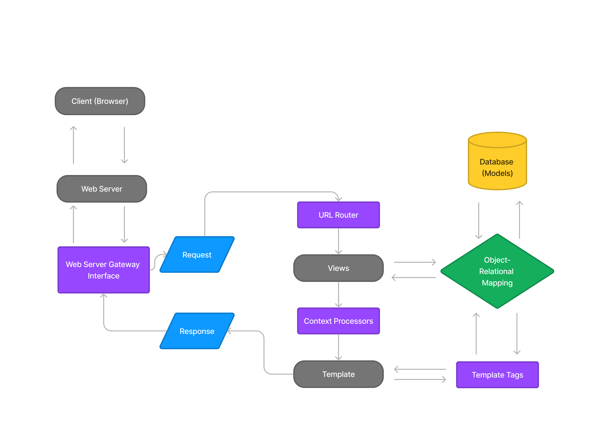

https://best-inventory-app.adaptable.app/

### Q1
**Jelaskan bagaimana cara kamu mengimplementasikan checklist di atas secara step-by-step (bukan hanya sekadar mengikuti tutorial).**

**Membuat sebuah proyek Django baru.**  
	- Membuat directory baru bernama player_inventory dengan menggunakan `django-admin startproject player_inventory .`, membuatnya menjadi sebuah git repository  
	-  Menghubungkan Git Lokal dengan repository di Github. Dan set branch lokal menjadi main (dalam step ini saya belum push)  
	- Membuat sebuah virtual enviroment di dalam directory, dengan menggunakan `python - m venv env`, dan mengaktifkanya.  
	- Menambahkan dependencies yang diperlukan ke dalam virtual envioment, dependencies merupakan komponen atau modul software yang diperlukan saat development.  
	- Konfigurasi settings.py dalam project agar bisa mendeploy  
	- Menambah berkas .gitignore, dan membuat supaya hanya file yang diperlukan akan dipush  
	

**Membuat aplikasi dengan nama main pada proyek tersebut.**  
	- Mengaktivasi Virtual enviroment dalam directory utama.  
	- dalam directory ini, buatlah sebuah app bernama 'main'(dalam sebuah web app, 'app' mempunyai arti spesifik, seperti sebuah home page atau form contact CS), dengan menggunakan `python manage.py startapp main`  
	- dalam direktori utama project, tambahkan `main` ke dalam list `INSTALLED_APPS`
	   yang terletak di dalam settings.py  
	- dalam direktori `main`, buatlah direktori baru `templates`, dalam direktori ini buatlah html file bernama `main`  
	   
**Melakukan routing pada proyek agar dapat menjalankan aplikasi main.**  
	- Dalam direktori utama, buka file `urls.py`, dan dari `django.urls` import `path`, dan `include`  
	- untuk menambahkan path `main` ke project tambahlah `path('main/', include('main.urls'))` dalam `urlpatterns`  
	- ini menambahkan routing `main` ke url project dan akan terlihat saat memasukkan `example.com/main` ke browser  

**Membuat model pada aplikasi main dengan nama Item dan memiliki atribut wajib sebagai berikut.**  
	- isi berkas `models.py` dengan models yang akan di migrate.  
	- dalam kasus tugas, model yang akan dipakai bernama `item`, dimana ia mempunyai atribut `name` yang merupakan CharField, `amount` yang merupakan IntegerField, dan `description` yang merupakan TextField.  
	- Class ini menginherit dari kelas dasar `models` dari Django, yang mendefinisikan semua atribut dari kelas sebagai kolom di database, ini merupakan bagian dari Object-Relational Mapping (ORM) system Django yang memungkinkan kita untuk menentukan struktur dan perilaku data.  
	- sehabis membuat model, jalankan perintah `python manage.py makemigrations`, ini menyiapkan query database project untuk memasuki data yang sesuai dengan model yang sudah diberikan  
	- sehabis itu jalankan `python manage.py migrate`, ini akan mengaplikasikan perubahan model dalam file migrasi  

**Membuat sebuah fungsi pada views.py untuk dikembalikan ke dalam sebuah template HTML yang menampilkan nama aplikasi serta nama dan kelas kamu.**  
	- Dalam direktori `main` buka file `views.py`, dan dari library `django shortcuts` import `render`, ini untuk me-render tampilan HTML dengan data yang diberikan  
	- Tambahkan fungsi `show_main` dengan paramater request
	- isi `context` dengan data yang ingin ditampilkan
	- untuk page saya, context merupakan zipped list dari 3 list berbeda `name`, `amount`, dan `description` yang akan di render di `main.html`

**Membuat sebuah routing pada urls.py aplikasi main untuk memetakan fungsi yang telah dibuat pada views.py.**  
	- Membuat file `urls.py` dalam direktori main  
	- import fungsi `path` dari `django.urls` untuk mendefisnisikan URL pattern  
	- import function `show_main` yang dibuat di views.py  
	- set `app_name` menjadi `main`, ini menjadi namespace pattern URL app yang dibuat  
	- mengisi file dengan URL_PATTERN yang mengarah ke function `show_main` yang dibuat dalam `views.py`   
	- dengan konfigurasi ini, saat user datang ke url yang disetting, `show_main` view function akan dicall untuk menghandle requst  

**Melakukan deployment ke Adaptable terhadap aplikasi yang sudah dibuat sehingga nantinya dapat diakses oleh teman-temanmu melalui Internet.**  
	- membuat sebuah app baru di Adaptable yang terhubung ke github.  
	- Buat Python App Template sebagai template deployment dan PostgreSQL sebagai tipe basis data dan deploy aplikasi dengan start command `python manage.py migrate && gunicorn player_inventory.wsgi`.  

---

### Q2
**Buatlah bagan yang berisi request client ke web aplikasi berbasis Django beserta responnya dan jelaskan pada bagan tersebut kaitan antara urls.py, views.py, models.py, dan berkas html.**

Urls.py berfungsi untuk menghubungkan antara url yang diakses oleh user dengan views.py. 
Urls.py akan mengarahkan user ke views.py yang akan menentukan apa yang akan ditampilkan ke user. 
Views.py akan mengambil data dari models.py yang berisi data yang akan ditampilkan ke user. 
Setelah itu, views.py akan mengirimkan data ke html yang akan ditampilkan ke user.

### Q3
**Jelaskan mengapa kita menggunakan virtual environment? Apakah kita tetap dapat membuat aplikasi web berbasis Django tanpa menggunakan virtual environment?**
    
- kita menggunakan virtual enviroment untuk membuat sebuah lingkungan yang 'terisolasi' dimana kita bisa menginstall dependencies dan versi framework yang kita inginkan tanpa adanya dampak secara global di mesin kita, ini berguna jika misalnya kita memperlukan suatu versi python atau django yang spesifik untuk suatu project yang kita ingin kerjakan, dengan virtual enviroment, 'lingkungan' ini akan bisa dikerjakan dengan versi yang diperlukan dan kita bisa activate dan deactivate saat kita selesai mengerjakanya. Kita tetap bisa membuat sebuah aplikasi web django tanpa menggunakan virtual enviroment, namun ini tidak direkomendasikan, karena misalnya jika kita ingin mengerjakan project yang berbeda tanpa menggunakan virtual enviroment, dependecies akan terinstall secara global, hal ini bisa berdampak buruk jika kita ingin mengerjakan suatu project baru dengan dependencies dan versi django yang berbeda.

### Q4
Jelaskan apakah itu MVC, MVT, MVVM dan perbedaan dari ketiganya.

- **MVC**
    Model-View-Controller (MVC) merupakan pola arsitektur aplikasi yang memisahkan code menjadi:
        Model -> Bagian logika data aplikasi yang akan didisplay atau dimanipulasi 
        View -> Bagian yang menampilkan informasi dengan bentuk UI
        Controller -> Bagian "logika" aplikasi yang mengubungkan model dan view 
        dan mengatur request yang masuk
        
- **MVT**
    Model-Views-Template merupakan pola arsitektur aplikasi yang digunakan oleh Django web framework, implementasinya pada dasarnya sangat mirip dengan MVT, dengan beberapa penamaan yang beda. Salah satu perbedaan yang utama adalah di MVT Controller sudah ada dari framework dan tidak perlu dicode sendiri.
        Model -> Dalam Django model sama saja dengan bagian model di MVC, yaitu sebuah logika data aplikasi yang biasanya direpresentasikan oleh database yang didisplay atau dimanipulasi.
        View -> Dalam Django, view lebih menyerupai "Controller" arsitektur MVC, dimana ia menyerupai handler untuk memproses http request dan mengembalikan response menggunakan data dari `model` dan merender UI dari `Template`
        Template -> Dalam Django, Template merupakan struktur atau layout dari UI.

- **MVVM**
    Model-view-viewmodel merupakan pola arsitektur yang memisah pengembangan GUI (View) dan logika bisnis (model), ini dilakukan agar 'view' tidak bergantung pada skema 'model' yang spesifik
        Model -> Merupakan model yang merepresentasikan data yang digunakan pada logika bisnis
        View -> Merupakan struktur UI yang juga menerima user input
            ViewModel -> Terletak di antara model dan View, ViewModel mempunyai controls untuk berinteraksi dengan view, berbeda dengan MVC, MVVM mempunyai sebuah *Binder* yang berkomunikasi dengan view dan properti di viewmodel.
