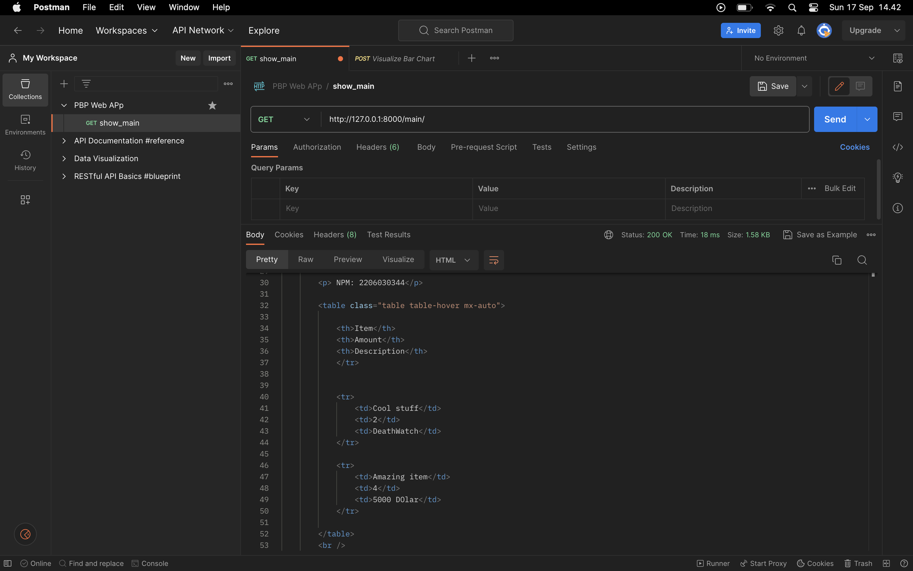
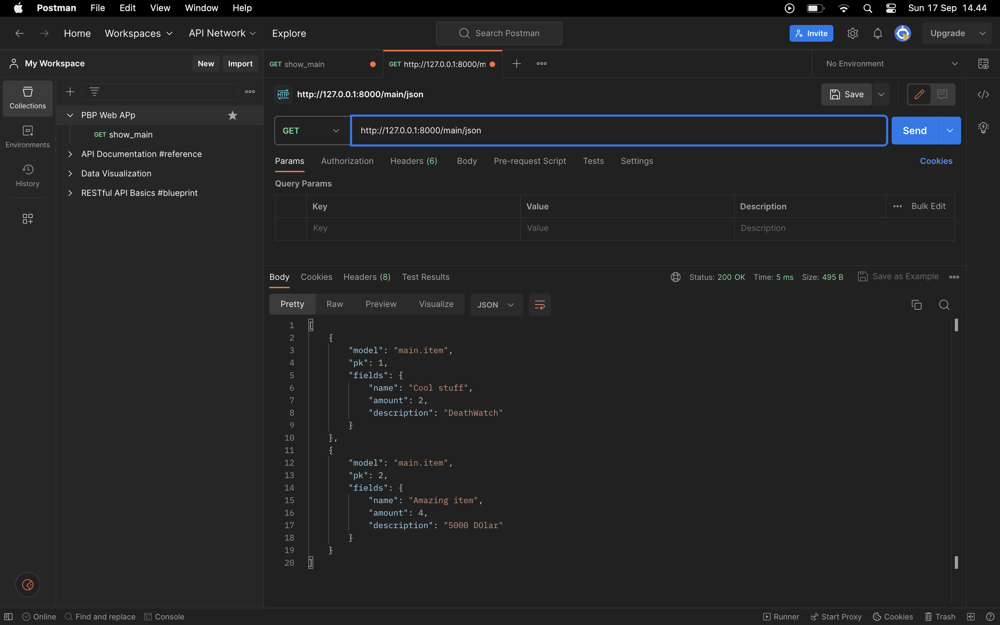
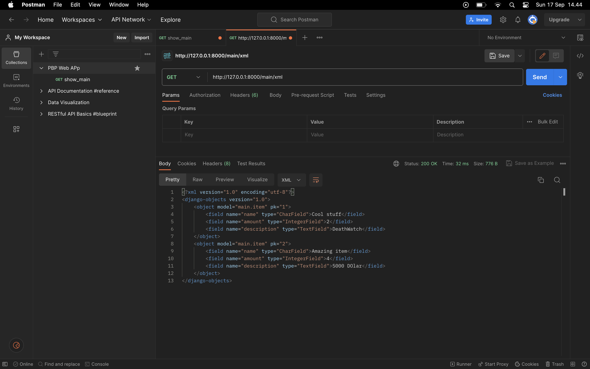
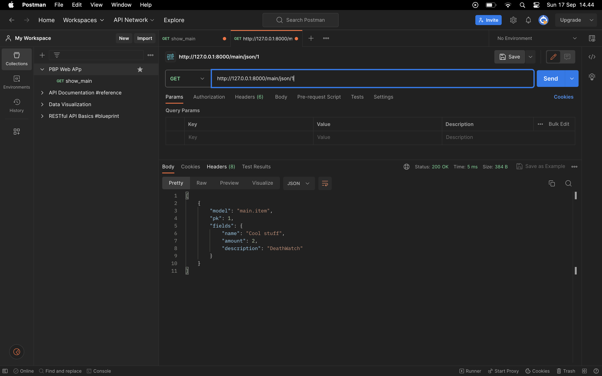
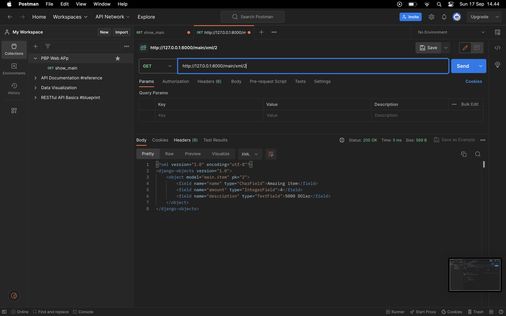

# TUGAS 5
### Q5.1
**Jelaskan perbedaan antara asynchronous programming dengan synchronous programming.**  
Synchronous programming adalah sebuah proses yang berjalan secara sequential, dimana setiap baris kode akan dieksekusi satu per satu, dan baris kode selanjutnya akan dieksekusi setelah baris kode sebelumnya selesai dieksekusi.  

Asynchronous programming adalah sebuah proses yang berjalan secara parallel, dimana setiap baris kode akan dieksekusi secara bersamaan, dan baris kode selanjutnya tidak perlu menunggu baris kode sebelumnya selesai dieksekusi.  

### Q5.2 
**Dalam penerapan JavaScript dan AJAX, terdapat penerapan paradigma event-driven programming. Jelaskan maksud dari paradigma tersebut dan sebutkan salah satu contoh penerapannya pada tugas ini.**  
event-driven programming merupakan sebuah paradigma programming yang dimana kode yang ditulis menunggu event yang terjadi, dan akan dieksekusi ketika event tersebut terjadi.  
Contoh dalam tugas ini adalah ketika kita mengklik sebuah tombol, maka akan terjadi event click, dan kode yang ditulis akan dieksekusi ketika event click terjadi.  

### Q5.3
**Jelaskan penerapan asynchronous programming pada AJAX**   
AJAX merupakan teknik yang memungkinkan kita untuk mengirim dan menerima data dari server secara asynchronous.  
AJAX memungkinkan kita untuk mengirim dan menerima data secara asynchronous dengan menggunakan `XMLHttpRequest` object yang dibuat oleh javascript.  
Server akan mengembalikan response kembali ke client, yang dibaca oleh javascript, dan ditampilkan ke halaman web.  
AJAX memungkinkan kita untuk mengirim dan menerima data tanpa harus me-refresh halaman web.  

### Q5.4
**Pada PBP kali ini, penerapan AJAX dilakukan dengan menggunakan Fetch API daripada library jQuery. Bandingkanlah kedua teknologi tersebut dan tuliskan pendapat kamu teknologi manakah yang lebih baik untuk digunakan.**
Fetch API merupakan sebuah API untuk penerapan AJAX secara native di javascript, Fetch menggunakan promise untuk menghandle response dari server, promise merupakan sebuah object yang merepresentasikan sebuah nilai yang belum diketahui, yang akan diketahui di masa depan (bahkan jika mendapatkan error), saat response dari server sudah diketahui, promise akan mengembalikan response tersebut.   

Jquery merupakan sebuah library javascript yang mempunyai beberapa fitur, salah satunya adalah AJAX. method AJAX dari jquery menggunakan callback untuk menghandle response dari server.  

### Q5.5 
**step-by-step penerapan AJAX pada tugas ini**  
Untuk tugas ini kita membuat sebuah penerpana GET dan POST  
GET: 
- dalam `views.py` buat sebuah fungsi yang mengambil semua item dari databse dan mengmbalikanya semua di format json
- dalam `urls.py` buat sebuah routing baru untuk halaman json
- dalam `main`, karena menggunakan cards, saya membuat div baru yang ber-id `item_cards`
- dalam script yang dibuat di html main ini, saya membuat sebuah function yang akan mengambil semua item dari database dengan menggunakan fetch, dan mengembalikan response dalam bentuk json, lalu mengiterasi semua item yang ada, dan membuat sebuah card untuk setiap item yang ada, dan menambahkan card tersebut ke div yang sudah dibuat tadi

POST: 
- dalam `views.py`, saya membuat fungsi `add_item_ajax`, fungsi ini membuat item baru sesuai dengan model fields, dan user yang sedang login, lalu menyimpannya ke database 
dengan .save 
- jika berhasil disimpan, fungsi ini akan mengembalikan response dengan status code 201
- dalam `urls.py` buat sebuah routing baru untuk halaman add_item_ajax
- dalam `main`, saya membuat sebuah form di dalam modal yang akan mengirimkan data ke `add_item_ajax` dengan method POST, dan membuat sebuah button yang akan mengirimkan data ke `add_item_ajax` dengan method POST
- untuk membuat operasi seamless, kita membuat sebuah fungsi js bernama `refresh`, yang akan mengambil semua item dari database dengan fetch, dan mengembalikan response dalam bentuk json, lalu mengiterasi semua item yang ada, dan membuat sebuah card untuk setiap item yang ada, dan menambahkan card tersebut ke div yang sudah dibuat tadi, `refresh` akan berjalan secara asynchronous, sehingga tidak perlu me-refresh halaman web

---

# TUGAS 4
### Q4.1
**Jelaskan manfaat dari setiap element selector dan kapan waktu yang tepat untuk menggunakannya.**
Simple Selector:  
- `*` -> Mengambil semua element  
- `element` -> Mengambil element dengan nama tertentu  
- `.class` -> Mengambil element dengan class tertentu  
- `#id` -> Mengambil element dengan id tertentu  
- `element.class` -> Mengambil element dengan nama dan class tertentu  
- `element#id` -> Mengambil element dengan nama dan id tertentu  
Simple Selector ini bisa digunakan untuk mengambil element tertentu dengan nama, class, atau id tertentu.  

combinator selector:   
- `element element` -> Mengambil element yang merupakan child dari element tertentu  
- `element > element` -> Mengambil element yang merupakan direct child dari element tertentu  
- `element + element` -> Mengambil element yang merupakan sibling dari element tertentu (tepat setelah element tertentu)  
- `element ~ element` -> Mengambil element yang merupakan sibling dari element tertentu (setelah element tertentu)  

combinator selector ini bisa digunakan untuk mengambil element yang berada di dalam element tertentu, atau element yang berada di sebelah element tertentu.  

Pseudo-class selector:  
- `:active` -> Mengambil element yang sedang aktif  
- `:checked` -> Mengambil element yang sedang dicheck  
- `:enabled` dan ':disabled' -> Mengambil element yang sedang aktif atau tidak aktif  
- `:first-child` dan `:last-child` -> Mengambil element yang merupakan child pertama atau terakhir dari parentnya  
- `:nth-child(n)` -> Mengambil element yang merupakan child ke-n dari parentnya  
- `:nth-last-child(n)` -> Mengambil element yang merupakan child ke-n dari parentnya, dimulai dari belakang  
- `:first-of-type` dan `:last-of-type` -> Mengambil element yang merupakan child pertama atau terakhir dari parentnya dengan tipe tertentu  
- `:nth-of-type(n)` -> Mengambil element yang merupakan child ke-n dari parentnya dengan tipe tertentu  
- `:focus` -> Mengambil element yang sedang difokuskan (dengan keyboard)  
- `:hover` -> Mengambil element yang sedang dihover (mouse di atasnya)  
- `:not(selector)` -> Mengambil element yang bukan merupakan selector tertentu  
- `:root` -> Mengambil element root dari sebuah document (selalu <'html'>) 
- `:target` -> Mengambil element yang sedang ditargetkan oleh sebuah link  
- `:empty` -> Mengambil element yang tidak memiliki child (maupun jika ada komen) 
- `:only-child` -> Mengambil element yang merupakan satu-satunya child dari parentnya  
- `:only-of-type` -> Mengambil element yang merupakan satu-satunya child dari parentnya dengan tipe tertentu  

Pseudo-class selector merupakan selector yang bisa digunakan untuk mengambil element yang mempunyai state tertentu (seperti sedang dihover, atau sedang difokuskan), element yang mempnyai relasi tertentu (seperti child pertama, atau sibling), atau element yang mempunyai tipe tertentu (seperti child pertama dengan tipe tertentu).  

---

### Q4.2
**Jelaskan HTML5 Tag yang kamu ketahui.**  
Struktur: 
- `<header>` -> Digunakan untuk membuat header dari sebuah dokumen atau section.  
- `<nav>` -> Digunakan untuk membuat link navigasi.  
- `<DOCTYPE>` -> Digunakan untuk mendefinisikan tipe dokumen.  
- `<body>` 	-> Digunakan untuk mendefinisikan body dari sebuah dokumen.  
- `<meta>` -> Digunakan untuk mendefinisikan metadata dari sebuah dokumen.  
- `<link>` -> Digunakan untuk mendefinisikan link ke dokumen lain.  
- `<a>` -> Digunakan untuk mendefinisikan anchor hyperlink.  
- `<script>` -> Digunakan untuk mendefinisikan script client-side.  

Table:
- `<table>` -> Digunakan untuk mendefinisikan sebuah table.  
- `<tr>` -> Digunakan untuk mendefinisikan sebuah row dalam sebuah table.  
- `<th>` -> Digunakan untuk mendefinisikan sebuah header cell dalam sebuah table.  
- `<td>` -> Digunakan untuk mendefinisikan sebuah cell dalam sebuah table.  
- `<thead>` -> Digunakan untuk mengelompokkan header cell dalam sebuah table.  
- `<tbody>` -> Digunakan untuk mengelompokkan body content dalam sebuah table.  

Form:
- `<form>` -> Digunakan untuk mendefinisikan sebuah form.   
- `<input>` -> Digunakan untuk mendefinisikan sebuah input field.  
- `<textarea>` -> Digunakan untuk mendefinisikan sebuah text area.  
- `<button>` -> Digunakan untuk mendefinisikan sebuah button.(biasanya untuk submit)  
- `<label>` -> Digunakan untuk mendefinisikan sebuah label untuk sebuah input field.  

---

### Q4.3
**Jelaskan perbedaan antara margin dan padding.**  
| Margin | Padding |
| :--- | ---: |
|Merupakan jarak antara elemen dengan elemen lainnya | Merupakan jarak antara elemen dengan konten di dalamnya |
|Bisa menggunakan negative value | Tidak bisa menggunakan negative value | 
| Tidak mempengaruhi background | Mempengaruhi background |
| Bisa disetting secara automatis | Tidak bisa disetting secara automatis |
| Tidak mepengaruhi size | Mempengaruhi size |

### Q4.4
**Jelaskan perbedaan antara framework CSS Tailwind dan Bootstrap. Kapan sebaiknya kita menggunakan Bootstrap daripada Tailwind, dan sebaliknya?**  
CSS Tailwind, merupakan sebuah UI framework yang memberikan developer widget-widget tanpa tema atau komponen yang sudah jadi. Namun, memberi banyak fleksibilitas untuk mengatur tampilan dari komponen-komponen tersebut.  
kita sebaiknya menggunakan Tailwind jika:  
- Kita ingin membuat tampilan yang unik dan tidak terlalu bergantung pada tema yang sudah ada.  
- Kita ingin lebih fleksibel dalam mengatur tampilan dari komponen-komponen yang sudah ada.  

Bootstrap, merupakan sebuah UI kit yang mempunyai banyak komponen pre-built yang bisa digunakan untuk membangun sebuah website.Bootstrap digunakan developer yang ingin memakai komponen dengan tampilan yang konsisten tanpa harus membuatnya dari awal.   
Kita sebaiknya menggunakan Bootstrap jika:  
- Kita ingin membuat tampilan yang konsisten dan secara cepat  
- Kita ingin menggunakan komponen-komponen yang sudah ada dan fiturnya  

---
### Q4.5
**Step-by-step Kustomisasi login, register dan tambah inventori**  
Saya menggunakan Bootstrap framework untuk kustomisasi login, register, dan tambah inventori. (Karena paling mudah kelihatanya)  

Login:  
- Menggunakan 6 total Div untuk membuat tampilan login yang bagus  
- `
` untuk membuat container, paling luar   
- `
` membuat row yang akan mengisi container, dengan style yang akan membuat row berada di tengah, min-height 100vh untuk membuat row mengisi seluruh height dari viewport  
- `
` membuat column yang akan mengisi row, dengan ukuran medium (menggunakan 4 dari 12 column dari sistem grid bootstrap)  
-  `
` untuk header login, menempatkan text di tengah, dan menambhkan margin di bawah  
- setiap `
` untuk membuat form, dengan margin bawah 3  
- `
` untuk link register, yang akan menempatkan text di tengah dan menambahkan margin atas 3  

Register:  
Styling similar dengan login, kecuali cara menempatkan form yang berbeda  
Dalam Register, form sudah ada template dari Django, yaitu UserCreationForm, menggunakan forloop, bisa menempatkan label `<label>`, lalu dibawahnya input untuk mengisi form `<input>`, dimana:  
Label:  
- `for="{{ field.id_for_label }}"` untuk menghubungkan label dengan input  
- `class="form-label"` untuk menambahkan class form-label (dari bootstrap)  
- `{{ field.label }}` untuk menampilkan label dari form  

Input:  
- `type: {{ field.field.widget.input_type }}` untuk menampilkan tipe input  
- `name="{{ field.name }}"` untuk mengisi nama input ke HTML 
- `id={{field.id_for_label}}` untuk mengisi id input ke HTML 
- `placeholder` untuk menampilkan placeholder dari input  (di dalam input bar) 
- `class="form-control"` untuk menambahkan class form-control (juga dari bootstrap)  

Dalam Register, bootstrap yang digunakan ada di kedua form, dan juga di div untuk tombol 'daftar' di registrasi. 

Tambah Inventori:  
Styling mirip dengan yang sudah dimodif tadi, tapi menggunakan cards dari framework bootstrap, agar terlihat rapih.  
- `
` untuk membuat card utama yang mengitari form untuk membuat item baru 
- `
` untuk membuat header, yang merupakan judul dari card, yaitu menambah item baru, dengan warna background biru dan text putih  
- `
` untuk membuat body dari card, yang dalam kasus ini merupakan form dari view `create-item` 
- `
` untuk button submit yang akan mengisi seluruh width dari card, agar sizenya sama dan enak dilihat  
- saya juga menambahkan `widgets` dalam form, agar tampilan input form dapat disesuaikan dengan keinginan, seperti `TextInput` untuk input name, `NumberInput` untuk input amount, dan `Textarea` untuk input description, yang lalu bisa dikirim melalui context dengan `{{ field }}`  

BONUS:
untuk bonus saya menggunakan forloop dengan if condition  
forloop yang didapatkan di tutorial akan memberi class semua row yang sama `table-info` dan sebuah `data-url` dengan id item yang mendirect user kepada page `edit-item` dengan id item tersebut (walaupun saya telat untuk bonus minggu lalu hehe), kecuali row terakhir yang akan diberi class `table-danger`, tetapi akan tetap diberi `url` yang tepat  
ilusi hover didapatkan dari bootstrap untuk class seluruh `<table>` yang merupakan `table table-hover mx auto`  
dan yang paling penting adalah script jquery (yang ditempatkan di base.html) dan codenya yang disimpan dalam main.html, yang memberi fungsi onclick kepada tablerowc yang diberi `data-url` untuk mengarahkan user ke url yang sudah ditentukan  
---

# TUGAS 3
### Q3.1 
**Apa itu Django UserCreationForm, dan jelaskan apa kelebihan dan kekurangannya?**  
UserCreationForm merupakan sebuah form yang sudah disediakan oleh Django yang memungkinkan kita untuk membuat user baru dengan mudah.  
Kekurangan  dari UserCreationForm, adalah tampilan yang standar dari form ini, dan tidak ada fitur tambahan lain (seperti integrasi media sosial, atau pemberitahuan email).  

---

### Q3.2
**Apa perbedaan antara autentikasi dan otorisasi dalam konteks Django, dan mengapa keduanya penting?**  
**Autentikasi**:  
- Merupakan proses untuk memverifikasi identitas user yang ingin mengakses suatu sistem.  
- Dalam web app, mengacu kepada proses dimana sebuah user diminta memasukkan kredensialnya, lalu diverifikasi oleh sistem untuk memastikan bahwa user tersebut adalah user yang sebenarnya.  

**Otorisasi**:  
- Sebuah proses untuk memverifikasi bahwa user yang SUDAH terautentikasi memiliki akses ke resource tertentu.  
- Dalam web app, mengacu kepada proses dimana user yang sudah terautentikasi diberikan hak akses/izin ke halaman tertentu dan fungsionalitasnya  

Keduanya penting karena:  
- Merupakan bagian dari keamanan sistem, dimana autentikasi dan otorisasi merupakan dua hal yang berbeda, namun saling melengkapi.  
- Pemisahan antara autentikasi dan otorisasi memungkinkan kita untuk mengatur hak akses user dengan lebih mudah, karena kita bisa mengatur hak akses user berdasarkan role yang dimiliki oleh user tersebut. (AKA separation of concern)  
- Autentikasi dan otorisasi adalah dua aspek penting dari keamanan aplikasi web, dan keduanya diperlukan untuk memastikan bahwa aplikasi Anda aman dari ancaman eksternal dan bahwa pengguna memiliki akses yang tepat ke sumber daya.  

---

### Q3.3
**Apa itu cookies dalam konteks aplikasi web, dan bagaimana Django menggunakan cookies untuk mengelola data sesi pengguna?**  
Dalam konteks web app, Cookies merupakan potongan data yang dikirim dari server ke browser pengguna dan disimpan di sisi Client, Cookie seringkali digunakan untuk menyimpan informasi tentang user dan pengaturan user.  
Django menggunakan cookies untuk mengelola data sesi pengguna dengan menyimpan session ID di cookie, dan menyimpan data sesi di server.  
ini memungkinkan Django untuk mengatur data sesi pengguna tanpa menyimpan data sensitif di sisi client bahkan Django memberikan opsi untuk menggunakan cookie yang terenkripsi  

---

### Q3.4
**Apakah penggunaan cookies aman secara default dalam pengembangan web, atau apakah ada risiko potensial yang harus diwaspadai?**  
Penggunaan cookies tidak aman secara default dalam pengembangan web, karena cookies tidak terenkripsi dan bisa diakses oleh orang lain. Meskipun cookie sangat berguna untuk web development, kita harus berhati-hati dalam penggunaannya, karena cookie bisa digunakan untuk melakukan serangan keamanan seperti session Man-In-The-Middle Attack dan cross-site scripting.  

---

### Q3.5
**Mengimplementasikan fungsi registrasi, login, dan logout untuk memungkinkan pengguna untuk mengakses aplikasi sebelumnya dengan lancar** 
Ketiga fungsi ini akan dibuat di dalam aplikasi `main` yang sudah dibuat sebelumnya. 
 
Sebagai sebuah basis sebelum kita menghubungkan aplikasi dengan database (model Item)  

1. register:  
	- Dalam `views.py` import  
	`UserCreationForm` dari `django.contrib.auth.forms`  
	`redirect` dari `django.shortcuts`  
	`messages` dari `django.contrib`  
	- buatlah fungsi baru bernama `register` yang mengambil `request`  
	- Kita menggunakan sebuah user creation form untuk membuat user baru di web app kita, jika info register sudah valid maka kita akan membuat user baru dengan `form.save()` dan redirect user ke login page  
	- Buat sebuah template bernama `register.html` di dalam folder `templates` di `main`  
	- Buatlah sebuah form dengan method `POST` yang akan mengirimkan data ke `register` view function  
	- Dalam `urls.py` di `main` tambahkanlah sebuah routing baru untuk halaman register  
2. Login:  
	- Dalam `views.py` import `authenticate` dan `login` dari `django.contrib.auth`  
	- Buatlah sebuah function baru bernama `login` yang mengambil `request`, dalam function ini, kita menggunakan POST untuk mengembalikan detail login (username dan password) dan mengautentikasi dengan `authenticate()` jika valid, kita redirect user ke main page, dan jika tidak kita akan mengirim message error  
	- Buatlah sebuah template bernama `login.html` di dalam folder `templates` di `main`  
	- Buatlah sebuah form dengan method `POST` yang akan mengirimkan data ke `login` view function, di bawah form kita akan juga anchor link ke regitster page jika user belum mempunyai user account   
	- Dalam `urls.py` di `main` tambahkanlah sebuah routing baru untuk halaman login  
3. Logout:  
	- Dalam `views.py` import `logout` dari `django.contrib.auth`  
	- Buatlah sebuah function baru bernama `logout` yang mengambil `request`, dalam function ini, kita menggunakan function `logout(request)` dan return sebuah `redirect` ke login page  
	- Dalam main page, kita akan menambahkan sebuah button yang akan mengarahkan user ke logout page  
	- Dalam `urls.py` di `main` tambahkanlah sebuah routing baru untuk halaman logout  

Kita akan menambahkan restriksi login untuk fungsi dasar di web app kita, sehingga user tidak bisa mengakses page lain jika belum login.  
- Dalam `views.py` import `login_required` dari `django.contrib.auth.decorators`  
- Tambahkan decorator `@login_required` di setiap view function yang ingin kita restriksi (show_main) 

**Membuat dua akun pengguna dengan masing-masing tiga dummy data menggunakan model yang telah dibuat pada aplikasi sebelumnya untuk setiap akun di lokal.**
- Setelah Menghubungkan aplikasi dengan database, kita akan membuat 2 akun pengguna dengan 3 dummy data untuk setiap akun di lokal.  

**Menghubungkan model Item dengan User.**	
- Dalam `models.py`, kita akan mengimport module `user` dari `django.contrib.auth.models`  
- Pada class `Item`, kita akan menambahkan sebuah field `user` yang merupakan ForeignKey dari `User`, ini akan menghubungkan setiap item dengan user yang membuatnya  
- Setelah ini, dalam `views.py` pada `create_item` function, kita akan mengedit sehingga request user akan diassign ke user yang membuat item, dengan menggunakan form.save(commit=False), yang akan mendelay save ke database, dan hanya membuat sebuah instance dari Item   
product.user = request.user, yang akan mengassign user yang membuat item ke user yang sedang login  
product.save(), yang akan menyimpan item ke database  
- Pada fungsi `show_main` kita akan mengubahnya sehingga hanya menampilkan item yang dibuat oleh user yang sedang login, dengan mengfilter item yang dilihatkan memakai 
`Item.objects.filter(user=request.user)` 
kita juga akan mengubah context name sehingga username user yang sedang login diperlihatkan dengan mengganti context name menjadi `request.user.username`  
- Sehabis ini kita migrate perubahan kepada models menggunakan `makemigrations` lalu `migrate`  

**Menampilkan detail informasi pengguna yang sedang logged in seperti username dan menerapkan cookies seperti last login pada halaman utama aplikasi.**
- Dalam `views.py` import datetime  
- Dalam fungsi `login_user`, kita akan mengset cookie kepada waktu user terakhir kali login dengan `response.set_cookie('last_login', datetime.datetime.now())`  
- pada fungsi `show_main`, kita akan menambahkan sebuah context baru bernama `last_login` yang akan diisi dengan cookie yang sudah kita set tadi, menggunakan `request.COOKIES['last_login']` 
- pada fungsi logout, kita akan menghapus cookie yang sudah kita set tadi dengan `response.delete_cookie('last_login')`  
- Tentunya untuk semua ini terlihat, dalam `main.html` kita akan menambahkan sebuah template tag yang akan menampilkan waktu terakhir login user (bernama 'last_login)  

---

# TUGAS 2

### Q2.1
 **Membuat input `form` untuk menambahkan objek model pada app sebelumnya.**  
- Dalam Virtual enviroment yang active, kita perlu membuat sebuah *Skeleton* yang menjadi basis dari HTML kita, ini dilakukan agar semua aplikasi mempunyai tampilan yang konsisten di *views*  
- Pada *root* directory buatlah sebuah folder templates dan isi dengan file `base.html`, yang akan menjadi "base" dari HTML yang akan dibuat dari sekarang  
- Pada file `settings.py` dalam direktori projek `player_inventory`, kita akan menambah template yang ada di dalam *root* directory, dengan menambah `BASE_DIR/'templates'`, kepada `TEMPLATES`  
- Pada file `main.html` dalam aplikasi `main` , konfigurasilah agar meng-extend dari template dasar `base.html` dengan menggunakan `` dna mendeklarasi block yang akan dipakai    

- Model `item` saya merupakan sebuah class dengan 3 attribut, form perlu mengisi 3 atribut tersebut, karena ini `fields` yang perlu diisi dari form adalah name, amount, dan description  
- pada direktori `main` buatlah sebuah file bernama `forms.py`, yang merupakan code dari form yang akan dibuat buatlah sebuah class form `itemform` dengan meta class denagn atribut `fields` yang merupakan sebuah list yang terisi dengan atribut yang ingin dimasukkan sebagai input  
- Import beberapa library (termasuk form class yang baru dibuat) kepada `views.py`:
	1. `HttpResponseRedirect`, yang merupakan subclass dari `HttpResponse`, yang berguna untuk meredirect user kepada url spesifik  
	2. `reverse` yang membantu kita untuk tidak hardcode url full dan memakai *url pattern* 
-  Dalam `views.py` ini saya membuat function bernama `create_item` yang mengambil `request.post` dan membuat ItemForm baru berdasarkan request.post user, mengvalidasi input form (`form.is_valid`), save form (`form.save`) dan redirect user ke main page setelah selesai.  
- dalam file urls.py di main kita akan tambahkan routing baru untuk halaman form yang kita sudah buat  
- Setelah route telah dibuat, kita membuat tampilan dari form yang akan menjadi tempat menginput attribut. Ini dibuat dalam folder `templates` di `main` yang bernama `create_item.html`  
-  menggunakan `{{forms.as_table}}` , ini akan merender `fields` yang kita masukkan di fungsi create_item tadi menjadi tempat input untuk attribut-attribut yang kita masukkan. ini akan merender fields yang kita declare tadi sebagai `<tr>` di HTML.  
- Buatlah component input dengan tipe submit untuk mengkonfirmasi request ke view dan memassukan info Item ke database  
- Untuk mengakses form ini kita membuat sebuah anchor yang berupa button yang akan me-*redirect* ke page create_item  

---

### Q2.2
**Tambahkan 5 fungsi `views` untuk melihat objek yang sudah ditambahkan dalam format HTML, XML, JSON, XML _by ID_, dan JSON _by ID_**  

Dalam `views.py` kita bisa membuat function-function untuk mendisplay info tentang Models yang sudah dibuat dan tersimpan dengan berbagai format: 
- format html:  
	dalam fungsi `show_main` kita akan menambah context baru yaitu object `items` yang dideclare dengan menggunakan `Item.objects.all`, ini merupakan kumpulan data object `Item` yang sudah ada di database, dalam html main kita akan mmebuat sebuah tabel yang menunjukkan semua item yang sudah dibuat dengan mengiterasi di sebuah for loop dengan attribut yang sesuai.
- format JSON dan XML (semua `Item`):  
	Buat function baru bernama `show_json`/ `show_xml` dan seperti tadi declare sebuah variable data dan *retrieve* semua object Item yang ada menggunakan `Item.objects.all`, sehabis ini kita akan meng-*serialize* data yang ada menggunakan method `serialize` dari module `serializers` dari library `django.core`.  
	
	meng-*serialize* data intinya dalah untuk mengubah sebuah struktur data atau *object state* menjadi format yang bisa disimpan, ditransmit, atau dibagi dalam representasi text.   
	Untuk Json, Kita akan mengserialize data meggunakan `serializers.serialize("json",data)` dan return sebuah object Http response dengan content type `application/json`  
	Untuk XML, kita mengserialize data dengan menggunakan `serializers.serialize("xml",data)` dan return object Http response dengan content type `application/xml`  
	Sebuah content type adalah sebuah header yang mengindikasi tipe media atau format resource yang dikirim atau diterima.
- Format JSON dan XML (1 Item):  
	Untuk mengfilter item yang diinginkan kita bisa mengfilter item yang ada di data dengan id unik yang diberikan saat dibuat. ini bisa dilakukan dengan memakai .filter(pk=id) pada manager class Item.
	`Item.objects` merepresentasikan manager untuk model `Item` dan memungkinkan kita untuk melakukan query yang ingin dilakukan pada tabel Item di database  
	`.filter(pk=id)` digunakan untuk mengfilter query berdasarkan pk/primary key, dalam kasus ini adalah `id`, dan akan mereturn queryset yang cocok.
	metode untuk mereturn sama saja seperti format JSON dan XML biasa.

### Q2.3

---

**Membuat routing URL untuk masing-masing `views` yang telah ditambahkan pada poin 2.**  
Dalam `urls.py` di main kita akan routing semua function Http request yang kita sudah buat ke urlnya sendiri (dibawah `main/`)  
langkah pertama pastinya adalah untuk mengimport function-function yang sudah kita buat dengan  
	`from main.views import show_json, show_xml, show_xml_by_id, show_json_by_id`
, di list urlpatterns, dengan menggunakan `path`, kita akan routing url yang berbeda untuk semua function yang sudah dibuat.  
untuk format JSON dan XML:  
	`path('json/', show_json, name='show_json'), path('xml/', show_xml, name='show_xml')`  
untuk JSON dan XML dengan id:  
	`path('xml/<int:id>', show_xml_by_id, name='show_xml_by_id'), path('json/<int:id>', show_json_by_id, name='show_json_by_id')`

### Q2.4

---

**Apa perbedaan antara form `POST` dan form `GET` dalam Django?**  
Dalam Django, `POST` dan `GET` merupakan hanya kedua Http request yang dipakai saat menggunakan forms.  
Saat menggunakan `GET` , semua data form di encode ke dalam url dan diaapend ke url sebagai parameter query,URL berisi alamat tujuan pengiriman data, serta kunci dan nilai data. Karena ini, GET method dilimit oleh apa yang bisa dimasukkan ke dalam URL, dan yang diperblehkan hanya karakter ASCII.  
Saat menggunakan `POST`, data form berada di dalam *message body* dalam Http request.  
Dibandingkan dengan `POST`, `GET` kurang secure.  
Sebuah request yang bisa mengubah sistem harus menggunakan `POST`

---

### Q2.5
**Apa perbedaan utama antara XML, JSON, dan HTML dalam konteks pengiriman data?**  

1. **Struktur data**:
	- XML (Extensible Markup Language) menyimpan data dalam struktur pohon dengan namespace untuk kategori data yang berbeda. XML digunakan untuk menyimpan dan mengirim data yang terstruktur dengan tag yang dapat didefinisikan oleh pengguna.
	- JSON (JavaScript Object Notation) menggunakan struktur seperti map dengan key-value pair. JSON digunakan untuk mengirim dan menyimpan data yang terstruktur dengan syntax yang ringkas dan mudah dibaca.
	- HTML (HyperText Markup Language) digunakan untuk membangun web page dan menentukan bagaimana konten akan ditampilkan di browser. HTML menyimpan data dalam struktur bertingkat dengan tag dan atribut yang telah ditentukan sebelumnya.

2. **Efisiensi dan ukuran file**:
	- JSON memiliki ukuran file yang lebih kecil dan transmisi data yang lebih cepat dibandingkan dengan XML karena syntax yang padat
	- XML memiliki struktur tanda yang lebih kompleks untuk ditulis dan dibaca.
	- HTML memiliki ukuran file yang bervariasi tergantung pada kompleksitas web page yang dibangun

3. **Keamanan**:
	- XML dan JSON rentan terhadap serangan keamanan seperti serangan injeksi dan serangan DoS (Denial of Service)
	- XML memiliki risiko keamanan yang lebih tinggi karena mendukung DTD (Document Type Definition) yang dapat digunakan untuk mengeksekusi kode berbahaya
	- JSON lebih aman daripada XML karena tidak memiliki fitur seperti DTD yang rentan terhadap serangan

4. **Penggunaan**:
	- XML digunakan dalam berbagai industri dan aplikasi, seperti natrual language processing, pertukaran data antar sistem, konfigurasi aplikasi, dan penyimpanan data
	- JSON banyak digunakan dalam pengembangan web dan aplikasi mobile karena syntax yang sederhana dan mudah dibaca dan ditulis oleh manusia dan mesin
	- HTML digunakan untuk membangun halaman web dan menentukan tampilan dan struktur konten di browser

---

### Q2.6
**Mengapa JSON sering digunakan dalam pertukaran data antara aplikasi web modern?**  
Seperti yang disebut di dalam perbedaan-perbedaan tadi , JSON, atau JavaScript Object Notation sangat populer dikarenakan:  
- Syntax yang mudah dibaca oleh manusia dan diparse oleh mesin, karena ini tidak memerlukan kode tambahan untuk diproses
- Ukuran filenya yang kecil membantu dalam mempercepat transfer data dan hasil dari web service
- Kebanyakan framework di dunia aplikasi web menggunakan JavaScript sebagai dasarnya, JSON merupakan representasi object dari JavaScript, karena ini JSON merupakan cara paling mudah untuk memanipulasi dan menyimpan data dalam dunia aplikasi web.

---

### Q2.7
**Mengakses kelima URL di poin 2 menggunakan Postman, membuat screenshot dari hasil akses URL pada Postman, dan menambahkannya ke dalam README.md.**

---

# TUGAS 1

### Q1.1
**Jelaskan bagaimana cara kamu mengimplementasikan checklist di atas secara step-by-step (bukan hanya sekadar mengikuti tutorial).**

**Membuat sebuah proyek Django baru.**  
- Membuat directory baru bernama player_inventory dengan menggunakan `django-admin startproject player_inventory .`, membuatnya menjadi sebuah git repository  
-  Menghubungkan Git Lokal dengan repository di Github. Dan set branch lokal menjadi main (dalam step ini saya belum push)  
- Membuat sebuah virtual enviroment di dalam directory, dengan menggunakan `python - m venv env`, dan mengaktifkanya.  
- Menambahkan dependencies yang diperlukan ke dalam virtual envioment, dependencies merupakan komponen atau modul software yang diperlukan saat development.  
- Konfigurasi settings.py dalam project agar bisa mendeploy  
- Menambah berkas .gitignore, dan membuat supaya hanya file yang diperlukan akan dipush  
	

**Membuat aplikasi dengan nama main pada proyek tersebut.**  
- Mengaktivasi Virtual enviroment dalam directory utama.  
- dalam directory ini, buatlah sebuah app bernama 'main'(dalam sebuah web app, 'app' mempunyai arti spesifik, seperti sebuah home page atau form contact CS), dengan menggunakan `python manage.py startapp main`  
- dalam direktori utama project, tambahkan `main` ke dalam list `INSTALLED_APPS`
	yang terletak di dalam settings.py  
- dalam direktori `main`, buatlah direktori baru `templates`, dalam direktori ini buatlah html file bernama `main`  
	   
**Melakukan routing pada proyek agar dapat menjalankan aplikasi main.**  
- Dalam direktori utama, buka file `urls.py`, dan dari `django.urls` import `path`, dan `include`  
- untuk menambahkan path `main` ke project tambahlah `path('main/', include('main.urls'))` dalam `urlpatterns`  
- ini menambahkan routing `main` ke url project dan akan terlihat saat memasukkan `example.com/main` ke browser  

**Membuat model pada aplikasi main dengan nama Item dan memiliki atribut wajib sebagai berikut.**  
- isi berkas `models.py` dengan models yang akan di migrate.  
- dalam kasus tugas, model yang akan dipakai bernama `item`, dimana ia mempunyai atribut `name` yang merupakan CharField, `amount` yang merupakan IntegerField, dan `description` yang merupakan TextField.  
- Class ini menginherit dari kelas dasar `models` dari Django, yang mendefinisikan semua atribut dari kelas sebagai kolom di database, ini merupakan bagian dari Object-Relational Mapping (ORM) system Django yang memungkinkan kita untuk menentukan struktur dan perilaku data.  
- sehabis membuat model, jalankan perintah `python manage.py makemigrations`, ini menyiapkan query database project untuk memasuki data yang sesuai dengan model yang sudah diberikan  
- sehabis itu jalankan `python manage.py migrate`, ini akan mengaplikasikan perubahan model dalam file migrasi  

**Membuat sebuah fungsi pada views.py untuk dikembalikan ke dalam sebuah template HTML yang menampilkan nama aplikasi serta nama dan kelas kamu.**  
- Dalam direktori `main` buka file `views.py`, dan dari library `django shortcuts` import `render`, ini untuk me-render tampilan HTML dengan data yang diberikan  
- Tambahkan fungsi `show_main` dengan paramater request  
- isi `context` dengan data yang ingin ditampilkan  
- untuk page saya, context merupakan zipped list dari 3 list berbeda `name`, `amount`, dan `description` yang akan di render di `main.html`  

**Membuat sebuah routing pada urls.py aplikasi main untuk memetakan fungsi yang telah dibuat pada views.py.**  
- Membuat file `urls.py` dalam direktori main  
- import fungsi `path` dari `django.urls` untuk mendefisnisikan URL pattern  
- import function `show_main` yang dibuat di views.py  
- set `app_name` menjadi `main`, ini menjadi namespace pattern URL app yang dibuat  
- mengisi file dengan URL_PATTERN yang mengarah ke function `show_main` yang dibuat dalam `views.py`   
- dengan konfigurasi ini, saat user datang ke url yang disetting, `show_main` view function akan dicall untuk menghandle requst  

**Melakukan deployment ke Adaptable terhadap aplikasi yang sudah dibuat sehingga nantinya dapat diakses oleh teman-temanmu melalui Internet.**  
- membuat sebuah app baru di Adaptable yang terhubung ke github.  
- Buat Python App Template sebagai template deployment dan PostgreSQL sebagai tipe basis data dan deploy aplikasi dengan start command `python manage.py migrate && gunicorn player_inventory.wsgi`.  

---

### Q1.2
**Buatlah bagan yang berisi request client ke web aplikasi berbasis Django beserta responnya dan jelaskan pada bagan tersebut kaitan antara urls.py, views.py, models.py, dan berkas html.**

Urls.py berfungsi untuk menghubungkan antara url yang diakses oleh user dengan views.py.  
Urls.py akan mengarahkan user ke views.py yang akan menentukan apa yang akan ditampilkan ke user.  
Views.py akan mengambil data dari models.py yang berisi data yang akan ditampilkan ke user.  
Setelah itu, views.py akan mengirimkan data ke html yang akan ditampilkan ke user.

---

### Q1.3
**Jelaskan mengapa kita menggunakan virtual environment? Apakah kita tetap dapat membuat aplikasi web berbasis Django tanpa menggunakan virtual environment?**  
    
- kita menggunakan virtual enviroment untuk membuat sebuah lingkungan yang 'terisolasi' dimana kita bisa menginstall dependencies dan versi framework yang kita inginkan tanpa adanya dampak secara global di mesin kita, ini berguna jika misalnya kita memperlukan suatu versi python atau django yang spesifik untuk suatu project yang kita ingin kerjakan, dengan virtual enviroment, 'lingkungan' ini akan bisa dikerjakan dengan versi yang diperlukan dan kita bisa activate dan deactivate saat kita selesai mengerjakanya. Kita tetap bisa membuat sebuah aplikasi web django tanpa menggunakan virtual enviroment, namun ini tidak direkomendasikan, karena misalnya jika kita ingin mengerjakan project yang berbeda tanpa menggunakan virtual enviroment, dependecies akan terinstall secara global, hal ini bisa berdampak buruk jika kita ingin mengerjakan suatu project baru dengan dependencies dan versi django yang berbeda.

---

### Q1.4
Jelaskan apakah itu MVC, MVT, MVVM dan perbedaan dari ketiganya.

- **MVC**
    Model-View-Controller (MVC) merupakan pola arsitektur aplikasi yang memisahkan code menjadi: 
        Model -> Bagian logika data aplikasi yang akan didisplay atau dimanipulasi   
        View -> Bagian yang menampilkan informasi dengan bentuk UI  
        Controller -> Bagian "logika" aplikasi yang mengubungkan model dan view 
        dan mengatur request yang masuk 
        
- **MVT**
    Model-Views-Template merupakan pola arsitektur aplikasi yang digunakan oleh Django web framework, implementasinya pada dasarnya sangat mirip dengan MVT, dengan beberapa penamaan yang beda. Salah satu perbedaan yang utama adalah di MVT Controller sudah ada dari framework dan tidak perlu dicode sendiri. 
        Model -> Dalam Django model sama saja dengan bagian model di MVC, yaitu sebuah logika data aplikasi yang biasanya direpresentasikan oleh database yang didisplay atau dimanipulasi.    
        View -> Dalam Django, view lebih menyerupai "Controller" arsitektur MVC, dimana ia menyerupai handler untuk memproses http request dan mengembalikan response menggunakan data dari `model` dan merender UI dari `Template`  
        Template -> Dalam Django, Template merupakan struktur atau layout dari UI. 

- **MVVM**
    Model-view-viewmodel merupakan pola arsitektur yang memisah pengembangan GUI (View) dan logika bisnis (model), ini dilakukan agar 'view' tidak bergantung pada skema 'model' yang spesifik  
        Model -> Merupakan model yang merepresentasikan data yang digunakan pada logika bisnis    
        View -> Merupakan struktur UI yang juga menerima user input    
        ViewModel -> Terletak di antara model dan View, ViewModel mempunyai controls untuk berinteraksi dengan view, berbeda dengan MVC, MVVM mempunyai sebuah *Binder* yang berkomunikasi dengan view dan properti di viewmodel.   

---